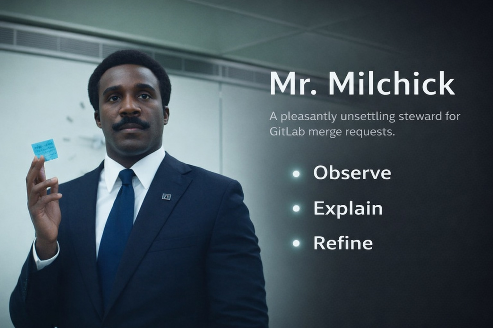

# Mr. Milchick

A pleasantly unsettling steward for GitLab merge requests.

Mr. Milchick observes.
Mr. Milchick refines.
Mr. Milchick ensures structural harmony.

This project is a Rust-based CLI tool designed to run inside GitLab CI pipelines and enforce merge request governance through calm, structured, policy‑driven automation.

It is not a bot.  
It is not a service.  
It is not a platform.  

It is a binary that cares.

---

## Purpose

Mr. Milchick exists to:

- enforce merge request workflow policies
- assign reviewers deterministically
- integrate CODEOWNERS intelligence into routing
- validate labels, branches and MR topology
- reduce coordination overhead in engineering teams
- provide explainable governance decisions

This tool is intended for environments where:

- GitLab Apps or external bots are restricted
- pipeline‑native automation is preferred
- workflow enforcement must be auditable
- governance logic must live in version control

---

## Philosophy

Mr. Milchick operates under these principles:

### Determinism over improvisation
The same merge request must produce the same outcome.

### Policy as code
Workflow governance evolves through normal code review.

### Calm enforcement
Strict automation does not need to be hostile.  
Politeness increases compliance.

### Structured tone
Human acceptance of automation is emotional.  
Tone is part of system design.

### Minimal infrastructure
No servers.  
No daemons.  
No persistent runtime.  

Only CI.  
Only execution.

---

## Command Model

Mr. Milchick supports three operational modes:

```
mr-milchick observe
mr-milchick refine
mr-milchick explain
```

I mean ... four if we're being honest: 
```
mr-milchick version

OUTPUT > mr-milchick 0.1.0 (2076d86 2026-03-16)
```


### observe

Policy evaluation dry‑run.

- reads CI context
- builds MR snapshot
- evaluates rule engine
- produces action plan
- does NOT mutate GitLab

### refine

Executes the planned governance actions.

May:

- assign reviewers
- post summary comments
- enforce blocking policies
- fail pipeline when required

### explain

Produces deep reasoning output.

Used for:

- debugging policy behavior
- understanding reviewer routing
- validating ownership logic
- inspecting rule outcomes

### version

Prints the binary version, git SHA and build date.

```
mr-milchick version
→ mr-milchick 0.1.0 (3f2c8ab 2026-03-16)
```

Useful for confirming which build is active in a pipeline without triggering any evaluation logic.

---

## Execution Flags

Mr. Milchick behavior is controlled through runtime flags and environment context.

### Dry‑Run Mode

```
MR_MILCHICK_DRY_RUN=true
```

Forces execution into non‑mutating mode even when running `refine`.

Used for:

- safe rollout
- CI experimentation
- policy validation

### CODEOWNERS Integration

```
MR_MILCHICK_CODEOWNERS_PATH=.gitlab/CODEOWNERS
```

Enables:

- ownership‑aware reviewer routing
- per‑file ownership aggregation
- hybrid routing (ownership + topology config)

If not provided:

- routing falls back to configured domain reviewers

---

## Tone System

Mr. Milchick communicates using structured tonal categories:

- Observation
- Refinement Opportunity
- Blocking Experience
- Pleasant Resolution
- Praise (future)

Tone is:

- deterministic per merge request
- architecture‑level, not cosmetic
- designed for institutional acceptance

Tone is not humor.  
Tone is operational ergonomics.

---

## Architecture Overview

```
CI Context
↓
GitLab Snapshot Intelligence
↓
Rule Engine
↓
Ownership Intelligence
↓
Reviewer Routing
↓
Action Planner
↓
Execution Strategy
↓
Structured Output
```

Key architectural domains:

### context/
CI parsing, normalization, execution mode inference.

### gitlab/
Snapshot client, DTO mapping, mutation API layer.

### rules/
Pure governance logic. No side effects.

### codeowners/
Ownership parsing and matching engine.

### routing/
Reviewer selection logic (topology + ownership).

### actions/
Action planning and execution abstraction.

### tone/
Deterministic narrative rendering.

### output/
Human‑readable CI reporting and MR comments.

---

## Why Rust

Mr. Milchick is written in Rust because:

- static binaries simplify CI distribution
- strong typing reduces governance risk
- async model suits API‑bound execution
- ownership model enforces architectural clarity
- long‑term maintainability is required

This is not a scripting utility.  
This is governance infrastructure.

---

## Current Capabilities

As of current development phase:

- strongly typed CI context model
- GitLab MR snapshot ingestion
- rule engine with severity classification
- deterministic reviewer routing
- hybrid CODEOWNERS + config routing
- action planning layer
- dry‑run execution strategy
- structured summary comment rendering
- explain mode parity with refine logic

---

## Example Local Execution

```
CI_PROJECT_ID=123
CI_MERGE_REQUEST_IID=456
CI_PIPELINE_SOURCE=merge_request_event
CI_MERGE_REQUEST_SOURCE_BRANCH_NAME=feat/example
CI_MERGE_REQUEST_TARGET_BRANCH_NAME=develop
CI_MERGE_REQUEST_LABELS="backend,needs-review"
MR_MILCHICK_DRY_RUN=true

cargo run -- observe
```

Mr. Milchick will begin observation.

---

## Long‑Term Direction

Planned system evolution includes:

- merge request risk scoring engine
- reviewer load balancing
- policy DSL for organizational governance
- workflow analytics layer
- adaptive tone intensity
- merge readiness intelligence
- team topology awareness

The objective is not automation.

The objective is engineering civilization.

---

## Contributing

Contributions must preserve:

- deterministic system behavior
- clear architectural boundaries
- policy clarity over cleverness
- calm operational tone

Unstructured enthusiasm will be gently redirected.

---

## Disclaimer

Mr. Milchick is fictional.  
The governance he enforces is not.

Proceed deliberately.